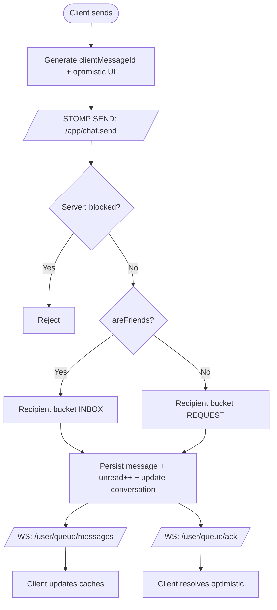

# UniVillage — Chat Messaging + Relationship (Friend) System
Blueprint kỹ thuật “AI đọc là code ngay” (Spring Boot + PostgreSQL + React Native/Expo + STOMP)

---

## 0) Mục tiêu & phạm vi

### Mục tiêu nghiệp vụ
- Nhắn tin 1-1 theo 2 trường hợp:
  - **Đã là bạn (ACCEPTED)** → Chat vào **INBOX**
  - **Chưa là bạn (NONE/PENDING)** → Tin nhắn vào **REQUEST (Message Requests)**
- Có hệ thống **Kết bạn** làm “gatekeeper” cho Chat.
- Có **Block/Restrict** để chặn tin nhắn và tương tác.
- Duy trì được các nhu cầu mở rộng: “người đã kết nối/đã từng nhắn tin”, tạo channel từ danh sách đó, group chat, media, push notification…

### Phạm vi kỹ thuật
- Backend: Spring Boot 3.x + JPA + PostgreSQL + STOMP over WebSocket
- Frontend: React Native + Expo Router + Zustand + React Query v5 + TypeScript
- Auth: JWT (stateless)
- Realtime: STOMP destinations `/app/*`, `/user/queue/*`

---

## 1) Nguyên tắc kiến trúc (Architecture Principles)

### 1.1 Separation of Concerns (SoC)
- **Relationship System (Gatekeeper)**
  - Source of truth cho trạng thái quan hệ: NONE/PENDING/ACCEPTED/BLOCKED/RESTRICTED
  - Quy tắc: ai được phép gửi friend request, ai được phép nhắn tin, ai bị block
- **Messaging System (Delivery + Routing)**
  - Routing hội thoại: INBOX vs REQUEST (Message Requests)
  - Persist message, unread_count, last_message_preview
  - Realtime delivery + ACK cho optimistic UI

### 1.2 Invariants (bất biến phải giữ)
- Không bao giờ tin `senderId` từ client → **luôn lấy từ JWT principal**
- **DIRECT conversation không được trùng** giữa 2 user → enforce bằng `direct_key` unique
- Gửi tin nhắn phải **idempotent** → unique `(conversation_id, client_message_id)`
- Nếu bị block (1 hoặc 2 chiều theo policy) → tin nhắn **bị reject/drop**

---

## 2) Business Logic chuẩn (Rules + Decision Matrix)

### 2.1 RelationshipStatus (two-row model)
- `NONE` (không có record)
- `PENDING_OUTGOING` (mình gửi lời mời)
- `PENDING_INCOMING` (mình nhận lời mời)
- `ACCEPTED`
- `BLOCKED` (một chiều)
- `RESTRICTED` (tuỳ chọn: hạn chế)

**Quy tắc cập nhật:**
- A gửi request cho B:
  - (A,B)=PENDING_OUTGOING
  - (B,A)=PENDING_INCOMING
- B accept:
  - (A,B)=ACCEPTED
  - (B,A)=ACCEPTED
- A block B:
  - (A,B)=BLOCKED
  - (B,A) = DELETE hoặc RESTRICTED (tuỳ yêu cầu tracking)

### 2.2 ParticipantStatus (routing inbox/request)
- `INBOX`: chat chính
- `REQUEST`: tin nhắn chờ duyệt
- `ARCHIVED`, `DELETED`: soft states

**Routing tin nhắn 1-1:**
| Điều kiện | Recipient participant status |
|---|---|
| Friends (ACCEPTED) | INBOX |
| Not friends (NONE/PENDING) | REQUEST |
| BLOCKED | reject/drop |

**Quy tắc thêm:**
- Sender luôn là `INBOX` (chủ động nhắn)
- Khi user bấm **Accept Message Request** → participant status của user đó chuyển `REQUEST → INBOX`
- Khi 2 người **trở thành bạn** → auto-upgrade DIRECT conversation (nếu có) để cả 2 là `INBOX`

---

## 3) Database Schema (PostgreSQL) — Production-ready

> Khuyến nghị dùng Flyway/Liquibase để migration.

### 3.1 `relationships` (Two-Row Model)
```sql
CREATE TABLE relationships (
  requester_id UUID NOT NULL,
  addressee_id UUID NOT NULL,
  status VARCHAR(20) NOT NULL CHECK (status IN
    ('PENDING_OUTGOING','PENDING_INCOMING','ACCEPTED','BLOCKED','RESTRICTED')
  ),
  created_at TIMESTAMP DEFAULT NOW(),
  updated_at TIMESTAMP DEFAULT NOW(),
  PRIMARY KEY (requester_id, addressee_id),
  FOREIGN KEY (requester_id) REFERENCES users(id) ON DELETE CASCADE,
  FOREIGN KEY (addressee_id) REFERENCES users(id) ON DELETE CASCADE
);

CREATE INDEX idx_rel_requester_status ON relationships(requester_id, status);
CREATE INDEX idx_rel_addressee_status ON relationships(addressee_id, status);
```

### 3.2 `conversations` (DIRECT/GROUP + direct_key unique)
```sql
CREATE TABLE conversations (
  id UUID PRIMARY KEY DEFAULT gen_random_uuid(),
  type VARCHAR(20) NOT NULL CHECK (type IN ('DIRECT','GROUP')),
  direct_key VARCHAR(100), -- ONLY for DIRECT
  last_message_id UUID,
  last_message_preview TEXT,
  updated_at TIMESTAMP DEFAULT NOW(),
  created_at TIMESTAMP DEFAULT NOW()
);

-- direct_key = LEAST(user1,user2) || ':' || GREATEST(user1,user2)
CREATE UNIQUE INDEX uq_conversations_direct_key
ON conversations(direct_key)
WHERE type='DIRECT';

CREATE INDEX idx_conversations_updated ON conversations(updated_at DESC);
```

### 3.3 `conversation_participants`
```sql
CREATE TABLE conversation_participants (
  conversation_id UUID NOT NULL,
  user_id UUID NOT NULL,
  status VARCHAR(20) NOT NULL CHECK (status IN ('INBOX','REQUEST','ARCHIVED','DELETED')),
  unread_count INTEGER DEFAULT 0,
  last_read_at TIMESTAMP,
  joined_at TIMESTAMP DEFAULT NOW(),
  PRIMARY KEY (conversation_id, user_id),
  FOREIGN KEY (conversation_id) REFERENCES conversations(id) ON DELETE CASCADE,
  FOREIGN KEY (user_id) REFERENCES users(id) ON DELETE CASCADE
);

CREATE INDEX idx_cp_user_status ON conversation_participants(user_id, status);
CREATE INDEX idx_cp_conversation ON conversation_participants(conversation_id);
```

### 3.4 `messages` (idempotency + correct FK)
> Nếu dùng `ON DELETE SET NULL` thì `sender_id` **phải nullable**.
```sql
CREATE TABLE messages (
  id UUID PRIMARY KEY DEFAULT gen_random_uuid(),
  conversation_id UUID NOT NULL,
  sender_id UUID, -- nullable to allow SET NULL
  client_message_id UUID NOT NULL, -- tempId from FE (idempotency)
  content TEXT NOT NULL,
  content_type VARCHAR(20) DEFAULT 'TEXT' CHECK (content_type IN ('TEXT','IMAGE','VIDEO','FILE','VOICE')),
  metadata JSONB,
  created_at TIMESTAMP DEFAULT NOW(),
  edited_at TIMESTAMP,
  deleted_at TIMESTAMP,
  FOREIGN KEY (conversation_id) REFERENCES conversations(id) ON DELETE CASCADE,
  FOREIGN KEY (sender_id) REFERENCES users(id) ON DELETE SET NULL,
  UNIQUE (conversation_id, client_message_id)
);

CREATE INDEX idx_msg_conv_created ON messages(conversation_id, created_at DESC);
```

---

## 4) Backend — Spring Boot (Code-ready)

### 4.1 Dependencies (Gradle/Maven)
- spring-boot-starter-web
- spring-boot-starter-security
- spring-boot-starter-websocket
- spring-boot-starter-data-jpa
- postgresql driver
- lombok
- flyway (recommended)
- validation (jakarta.validation)

### 4.2 Package structure
```
com.yourapp
├─ config
│  ├─ SecurityConfig.java
│  ├─ WebSocketConfig.java
│  ├─ WebSocketRateLimitInterceptor.java
│  └─ JwtHandshakeInterceptor.java
├─ common
│  ├─ exception
│  │  ├─ BusinessException.java
│  │  └─ ErrorCode.java
│  └─ util
│     └─ JwtUtil.java
├─ domain
│  ├─ relationship
│  │  ├─ entity
│  │  ├─ repository
│  │  ├─ service
│  │  ├─ controller (REST)
│  │  └─ dto
│  └─ messaging
│     ├─ entity
│     ├─ repository
│     ├─ service
│     ├─ controller (REST + WS)
│     └─ dto
└─ websocket
   ├─ handler
   │  ├─ CustomHandshakeHandler.java
   │  └─ StompPrincipal.java
   └─ dto (ws events)
```

---

## 5) WebSocket STOMP (Auth + Destinations + Contracts)

### 5.1 WebSocketConfig
```java
@Configuration
@EnableWebSocketMessageBroker
@RequiredArgsConstructor
public class WebSocketConfig implements WebSocketMessageBrokerConfigurer {

  private final JwtHandshakeInterceptor jwtHandshakeInterceptor;
  private final WebSocketRateLimitInterceptor rateLimitInterceptor;

  @Override
  public void configureMessageBroker(MessageBrokerRegistry config) {
    config.enableSimpleBroker("/topic", "/queue");
    config.setApplicationDestinationPrefixes("/app");
    config.setUserDestinationPrefix("/user");
  }

  @Override
  public void registerStompEndpoints(StompEndpointRegistry registry) {
    registry.addEndpoint("/ws-chat")
      .setAllowedOriginPatterns("*")
      .addInterceptors(jwtHandshakeInterceptor)
      .setHandshakeHandler(new CustomHandshakeHandler());
  }

  @Override
  public void configureClientInboundChannel(ChannelRegistration registration) {
    registration.interceptors(rateLimitInterceptor);
  }
}
```

### 5.2 JwtHandshakeInterceptor (token query param)
```java
@Component
@RequiredArgsConstructor
public class JwtHandshakeInterceptor implements HandshakeInterceptor {
  private final JwtUtil jwtUtil;

  @Override
  public boolean beforeHandshake(ServerHttpRequest req, ServerHttpResponse res,
                                 WebSocketHandler handler, Map<String, Object> attrs) {
    String q = req.getURI().getQuery(); // token=...
    if (q == null) return false;

    String token = Arrays.stream(q.split("&"))
      .map(p -> p.split("="))
      .filter(kv -> kv.length == 2 && kv[0].equals("token"))
      .map(kv -> kv[1])
      .findFirst().orElse(null);

    if (token == null || !jwtUtil.validate(token)) return false;

    UUID userId = jwtUtil.extractUserId(token);
    attrs.put("userId", userId.toString());
    return true;
  }

  @Override
  public void afterHandshake(ServerHttpRequest req, ServerHttpResponse res,
                             WebSocketHandler handler, Exception ex) {}
}
```

### 5.3 CustomHandshakeHandler + Principal
```java
public class StompPrincipal implements Principal {
  private final String name;
  public StompPrincipal(String name) { this.name = name; }
  @Override public String getName() { return name; }
}

public class CustomHandshakeHandler extends DefaultHandshakeHandler {
  @Override
  protected Principal determineUser(ServerHttpRequest request, WebSocketHandler wsHandler,
                                    Map<String, Object> attributes) {
    String userId = (String) attributes.get("userId");
    return new StompPrincipal(userId);
  }
}
```

### 5.4 Rate limit (WS spam control)
```java
@Component
public class WebSocketRateLimitInterceptor implements ChannelInterceptor {

  private final LoadingCache<String, AtomicInteger> counts =
    CacheBuilder.newBuilder().expireAfterWrite(1, TimeUnit.MINUTES)
      .build(new CacheLoader<>() {
        @Override public AtomicInteger load(String key) { return new AtomicInteger(0); }
      });

  @Override
  public Message<?> preSend(Message<?> message, MessageChannel channel) {
    StompHeaderAccessor acc = StompHeaderAccessor.wrap(message);
    if (StompCommand.SEND.equals(acc.getCommand())) {
      String userId = acc.getUser().getName();
      int c = counts.getUnchecked(userId).incrementAndGet();
      if (c > 120) throw new BusinessException(ErrorCode.RATE_LIMIT, "Too many messages");
    }
    return message;
  }
}
```

### 5.5 STOMP destinations (hợp đồng)
- Client → Server:
  - `SEND /app/chat.send`
- Server → Client (user-specific):
  - `/user/queue/messages` (tin nhắn mới)
  - `/user/queue/ack` (ACK optimistic)
  - `/user/queue/events` (friend accepted, blocked, conversation upgraded…)

---

## 6) Domain Entities (JPA) — đúng mapping cho composite keys

### 6.1 Relationship (two-row)
```java
@Embeddable
@Data @NoArgsConstructor @AllArgsConstructor
public class RelationshipId implements Serializable {
  private UUID requesterId;
  private UUID addresseeId;
}

public enum RelationshipStatus {
  PENDING_OUTGOING, PENDING_INCOMING, ACCEPTED, BLOCKED, RESTRICTED
}

@Entity
@Table(name="relationships")
@Data
public class Relationship {
  @EmbeddedId
  private RelationshipId id;

  @Enumerated(EnumType.STRING)
  @Column(nullable=false, length=20)
  private RelationshipStatus status;

  private LocalDateTime createdAt;
  private LocalDateTime updatedAt;

  @PrePersist void onCreate(){ createdAt = LocalDateTime.now(); updatedAt = createdAt; }
  @PreUpdate void onUpdate(){ updatedAt = LocalDateTime.now(); }
}
```

### 6.2 Conversation + Participant
```java
public enum ConversationType { DIRECT, GROUP }
public enum ParticipantStatus { INBOX, REQUEST, ARCHIVED, DELETED }

@Entity
@Table(name="conversations")
@Data
public class Conversation {
  @Id @GeneratedValue
  private UUID id;

  @Enumerated(EnumType.STRING)
  @Column(nullable=false, length=20)
  private ConversationType type;

  private String directKey;

  private UUID lastMessageId;

  @Column(columnDefinition="TEXT")
  private String lastMessagePreview;

  private LocalDateTime createdAt;
  private LocalDateTime updatedAt;

  @OneToMany(mappedBy="conversation", cascade=CascadeType.ALL, orphanRemoval=true)
  private Set<ConversationParticipant> participants = new HashSet<>();

  @PrePersist void onCreate(){ createdAt=LocalDateTime.now(); updatedAt=createdAt; }
  @PreUpdate void onUpdate(){ updatedAt=LocalDateTime.now(); }
}

@Embeddable
@Data @NoArgsConstructor @AllArgsConstructor
public class ConversationParticipantId implements Serializable {
  private UUID conversationId;
  private UUID userId;
}

@Entity
@Table(name="conversation_participants")
@Data
public class ConversationParticipant {
  @EmbeddedId
  private ConversationParticipantId id;

  @MapsId("conversationId")
  @ManyToOne(fetch=FetchType.LAZY)
  @JoinColumn(name="conversation_id")
  private Conversation conversation;

  @Column(name="user_id", insertable=false, updatable=false)
  private UUID userId;

  @Enumerated(EnumType.STRING)
  @Column(nullable=false, length=20)
  private ParticipantStatus status;

  private Integer unreadCount = 0;
  private LocalDateTime lastReadAt;
  private LocalDateTime joinedAt;

  @PrePersist void onCreate(){ joinedAt=LocalDateTime.now(); }
}
```

### 6.3 Message (idempotency)
```java
public enum ContentType { TEXT, IMAGE, VIDEO, FILE, VOICE }

@Entity
@Table(
  name="messages",
  uniqueConstraints=@UniqueConstraint(columnNames={"conversation_id","client_message_id"})
)
@Data
public class Message {
  @Id @GeneratedValue
  private UUID id;

  @Column(name="conversation_id", nullable=false)
  private UUID conversationId;

  @Column(name="sender_id")
  private UUID senderId; // nullable

  @Column(name="client_message_id", nullable=false)
  private UUID clientMessageId;

  @Column(nullable=false, columnDefinition="TEXT")
  private String content;

  @Enumerated(EnumType.STRING)
  @Column(length=20)
  private ContentType contentType = ContentType.TEXT;

  @Column(columnDefinition="jsonb")
  private String metadata;

  private LocalDateTime createdAt;
  private LocalDateTime editedAt;
  private LocalDateTime deletedAt;

  @PrePersist void onCreate(){ createdAt=LocalDateTime.now(); }
}
```

---

## 7) Repositories (Spring Data JPA)

### 7.1 RelationshipRepository
```java
@Repository
public interface RelationshipRepository extends JpaRepository<Relationship, RelationshipId> {

  Optional<Relationship> findByIdRequesterIdAndIdAddresseeId(UUID requesterId, UUID addresseeId);

  List<Relationship> findByIdRequesterIdAndStatus(UUID requesterId, RelationshipStatus status);

  @Query("""
    SELECT CASE WHEN COUNT(r) > 0 THEN true ELSE false END
    FROM Relationship r
    WHERE r.id.requesterId = :userId AND r.id.addresseeId = :targetId
      AND r.status = 'BLOCKED'
  """)
  boolean isBlocked(UUID userId, UUID targetId);

  @Query("""
    SELECT CASE WHEN COUNT(r) > 0 THEN true ELSE false END
    FROM Relationship r
    WHERE r.id.requesterId = :userId AND r.id.addresseeId = :targetId
      AND r.status = 'ACCEPTED'
  """)
  boolean areFriends(UUID userId, UUID targetId);
}
```

### 7.2 ConversationRepository
```java
@Repository
public interface ConversationRepository extends JpaRepository<Conversation, UUID> {
  Optional<Conversation> findByDirectKeyAndType(String directKey, ConversationType type);

  @Query("""
    SELECT c FROM Conversation c
    JOIN c.participants p
    WHERE p.userId = :userId AND p.status = :status
    ORDER BY c.updatedAt DESC
  """)
  List<Conversation> findByUserAndStatus(UUID userId, ParticipantStatus status);
}
```

### 7.3 ParticipantRepository
```java
@Repository
public interface ConversationParticipantRepository
  extends JpaRepository<ConversationParticipant, ConversationParticipantId> {

  @Query("""
    SELECT p FROM ConversationParticipant p
    WHERE p.id.conversationId = :conversationId AND p.userId = :userId
  """)
  Optional<ConversationParticipant> findOne(UUID conversationId, UUID userId);

  List<ConversationParticipant> findByIdConversationId(UUID conversationId);
}
```

### 7.4 MessageRepository
```java
@Repository
public interface MessageRepository extends JpaRepository<Message, UUID> {
  Page<Message> findByConversationIdAndDeletedAtIsNullOrderByCreatedAtDesc(UUID conversationId, Pageable pageable);

  Optional<Message> findByConversationIdAndClientMessageId(UUID conversationId, UUID clientMessageId);
}
```

---

## 8) Services — CORE logic (Friend + Chat)

### 8.1 RelationshipService (Friend APIs)
**Nghiệp vụ bắt buộc**: send, accept, decline, cancel, block, unblock, getStatus

```java
@Service
@RequiredArgsConstructor
public class RelationshipService {
  private final RelationshipRepository repo;
  private final ConversationParticipantRepository participantRepo; // for auto-upgrade
  private final ConversationRepository conversationRepo;

  @Transactional
  public void sendFriendRequest(UUID requesterId, UUID addresseeId) {
    if (requesterId.equals(addresseeId)) throw new BusinessException(ErrorCode.INVALID, "Cannot friend yourself");
    if (repo.isBlocked(addresseeId, requesterId) || repo.isBlocked(requesterId, addresseeId))
      throw new BusinessException(ErrorCode.BLOCKED, "Blocked");

    RelationshipStatus existing = getRelationshipStatus(requesterId, addresseeId);
    if (existing == RelationshipStatus.ACCEPTED) throw new BusinessException(ErrorCode.CONFLICT, "Already friends");
    if (existing == RelationshipStatus.PENDING_OUTGOING) throw new BusinessException(ErrorCode.CONFLICT, "Already sent");

    upsert(requesterId, addresseeId, RelationshipStatus.PENDING_OUTGOING);
    upsert(addresseeId, requesterId, RelationshipStatus.PENDING_INCOMING);
  }

  @Transactional
  public void acceptFriendRequest(UUID userId, UUID requesterId) {
    Relationship incoming = repo.findByIdRequesterIdAndIdAddresseeId(userId, requesterId)
      .orElseThrow(() -> new BusinessException(ErrorCode.NOT_FOUND, "Request not found"));

    if (incoming.getStatus() != RelationshipStatus.PENDING_INCOMING)
      throw new BusinessException(ErrorCode.INVALID, "Invalid status");

    upsert(userId, requesterId, RelationshipStatus.ACCEPTED);
    upsert(requesterId, userId, RelationshipStatus.ACCEPTED);

    // Auto-upgrade chat if DIRECT exists
    String dk = directKey(userId, requesterId);
    conversationRepo.findByDirectKeyAndType(dk, ConversationType.DIRECT).ifPresent(conv -> {
      participantRepo.findOne(conv.getId(), userId).ifPresent(p -> { p.setStatus(ParticipantStatus.INBOX); participantRepo.save(p); });
      participantRepo.findOne(conv.getId(), requesterId).ifPresent(p -> { p.setStatus(ParticipantStatus.INBOX); participantRepo.save(p); });
    });
  }

  @Transactional
  public void declineFriendRequest(UUID userId, UUID requesterId) {
    repo.findByIdRequesterIdAndIdAddresseeId(userId, requesterId).ifPresent(repo::delete);
    repo.findByIdRequesterIdAndIdAddresseeId(requesterId, userId).ifPresent(repo::delete);
  }

  @Transactional
  public void cancelFriendRequest(UUID requesterId, UUID addresseeId) {
    repo.findByIdRequesterIdAndIdAddresseeId(requesterId, addresseeId).ifPresent(repo::delete);
    repo.findByIdRequesterIdAndIdAddresseeId(addresseeId, requesterId).ifPresent(repo::delete);
  }

  @Transactional
  public void blockUser(UUID userId, UUID targetId) {
    upsert(userId, targetId, RelationshipStatus.BLOCKED);
    repo.findByIdRequesterIdAndIdAddresseeId(targetId, userId).ifPresent(repo::delete);
  }

  @Transactional
  public void unblockUser(UUID userId, UUID targetId) {
    repo.findByIdRequesterIdAndIdAddresseeId(userId, targetId).ifPresent(repo::delete);
  }

  public RelationshipStatus getRelationshipStatus(UUID userId, UUID targetId) {
    return repo.findByIdRequesterIdAndIdAddresseeId(userId, targetId)
      .map(Relationship::getStatus).orElse(null); // NONE
  }

  public boolean areFriends(UUID userId, UUID targetId) { return repo.areFriends(userId, targetId); }
  public boolean isBlocked(UUID userId, UUID targetId) { return repo.isBlocked(userId, targetId); }

  private void upsert(UUID a, UUID b, RelationshipStatus st) {
    RelationshipId id = new RelationshipId(a, b);
    Relationship r = repo.findById(id).orElseGet(() -> { Relationship x = new Relationship(); x.setId(id); return x; });
    r.setStatus(st);
    repo.save(r);
  }

  private String directKey(UUID a, UUID b) { return a.compareTo(b) < 0 ? a + ":" + b : b + ":" + a; }
}
```

### 8.2 DirectConversationService (getOrCreate DIRECT, không trùng)
```java
@Service
@RequiredArgsConstructor
public class DirectConversationService {

  private final ConversationRepository conversationRepo;
  private final ConversationParticipantRepository participantRepo;

  @Transactional
  public Conversation getOrCreate(UUID u1, UUID u2, boolean areFriends) {
    String key = directKey(u1, u2);

    return conversationRepo.findByDirectKeyAndType(key, ConversationType.DIRECT)
      .orElseGet(() -> {
        Conversation c = new Conversation();
        c.setType(ConversationType.DIRECT);
        c.setDirectKey(key);
        c = conversationRepo.save(c);

        ConversationParticipant p1 = build(c, u1, ParticipantStatus.INBOX);
        ConversationParticipant p2 = build(c, u2, areFriends ? ParticipantStatus.INBOX : ParticipantStatus.REQUEST);

        c.getParticipants().add(p1);
        c.getParticipants().add(p2);
        return conversationRepo.save(c);
      });
  }

  private ConversationParticipant build(Conversation c, UUID uid, ParticipantStatus st) {
    ConversationParticipant p = new ConversationParticipant();
    p.setId(new ConversationParticipantId(c.getId(), uid));
    p.setConversation(c);
    p.setUserId(uid);
    p.setStatus(st);
    p.setUnreadCount(0);
    return p;
  }

  private String directKey(UUID a, UUID b) { return a.compareTo(b) < 0 ? a + ":" + b : b + ":" + a; }
}
```

### 8.3 ChatService (CORE routing INBOX/REQUEST + idempotency + unread)
```java
@Service
@RequiredArgsConstructor
@Slf4j
public class ChatService {

  private final RelationshipService relationshipService;
  private final DirectConversationService directConversationService;
  private final ConversationRepository conversationRepo;
  private final ConversationParticipantRepository participantRepo;
  private final MessageRepository messageRepo;
  private final SimpMessagingTemplate ws;

  @Transactional
  public void handleIncoming(UUID senderId, ChatSendPayload payload) {
    UUID recipientId = payload.getRecipientId();

    // 1) Gate: block
    if (relationshipService.isBlocked(recipientId, senderId) || relationshipService.isBlocked(senderId, recipientId)) {
      throw new BusinessException(ErrorCode.BLOCKED, "You are blocked");
    }

    // 2) Relationship
    boolean areFriends = relationshipService.areFriends(senderId, recipientId);

    // 3) Conversation
    Conversation c = directConversationService.getOrCreate(senderId, recipientId, areFriends);

    // 4) Participants
    ConversationParticipant ps = participantRepo.findOne(c.getId(), senderId)
      .orElseThrow(() -> new BusinessException(ErrorCode.CORRUPTED, "Sender participant missing"));
    ConversationParticipant pr = participantRepo.findOne(c.getId(), recipientId)
      .orElseThrow(() -> new BusinessException(ErrorCode.CORRUPTED, "Recipient participant missing"));

    // Recipient routing
    if (areFriends) {
      if (pr.getStatus() != ParticipantStatus.INBOX) pr.setStatus(ParticipantStatus.INBOX);
    } else {
      // If recipient already upgraded before (INBOX), keep it. Otherwise REQUEST.
      if (pr.getStatus() != ParticipantStatus.INBOX) pr.setStatus(ParticipantStatus.REQUEST);
    }

    // Sender always INBOX
    if (ps.getStatus() != ParticipantStatus.INBOX) ps.setStatus(ParticipantStatus.INBOX);

    participantRepo.save(ps);
    participantRepo.save(pr);

    // 5) Idempotency
    UUID clientMsgId = payload.getClientMessageId();
    Message message = messageRepo.findByConversationIdAndClientMessageId(c.getId(), clientMsgId)
      .orElseGet(() -> {
        Message m = new Message();
        m.setConversationId(c.getId());
        m.setSenderId(senderId);
        m.setClientMessageId(clientMsgId);
        m.setContent(payload.getContent());
        m.setContentType(ContentType.TEXT);
        return messageRepo.save(m);
      });

    // 6) Update conversation + unread
    c.setLastMessageId(message.getId());
    c.setLastMessagePreview(truncate(message.getContent(), 100));
    conversationRepo.save(c);

    pr.setUnreadCount(pr.getUnreadCount() + 1);
    participantRepo.save(pr);

    // 7) WS events
    boolean isRequest = (!areFriends && pr.getStatus() == ParticipantStatus.REQUEST);

    ws.convertAndSendToUser(
      recipientId.toString(),
      "/queue/messages",
      ChatMessageEvent.from(message, c.getId(), senderId, isRequest)
    );

    ws.convertAndSendToUser(
      senderId.toString(),
      "/queue/ack",
      new AckEvent(clientMsgId, message.getId(), "SENT")
    );
  }

  @Transactional
  public void acceptMessageRequest(UUID userId, UUID conversationId) {
    ConversationParticipant p = participantRepo.findOne(conversationId, userId)
      .orElseThrow(() -> new BusinessException(ErrorCode.NOT_FOUND, "Conversation participant not found"));

    p.setStatus(ParticipantStatus.INBOX);
    participantRepo.save(p);

    ws.convertAndSendToUser(
      userId.toString(),
      "/queue/events",
      new ConversationUpgradedEvent(conversationId, "INBOX")
    );
  }

  @Transactional
  public void markRead(UUID userId, UUID conversationId) {
    ConversationParticipant p = participantRepo.findOne(conversationId, userId)
      .orElseThrow(() -> new BusinessException(ErrorCode.NOT_FOUND, "Conversation participant not found"));
    p.setUnreadCount(0);
    p.setLastReadAt(LocalDateTime.now());
    participantRepo.save(p);
  }

  private String truncate(String s, int n){ return s.length() > n ? s.substring(0,n) + "..." : s; }
}
```

---

## 9) DTOs & WS Events (Contracts)

### 9.1 WS Payloads
```java
@Data
public class ChatSendPayload {
  private String content;
  private UUID recipientId;
  private UUID clientMessageId; // FE-generated UUID (temp id)
}

@Data @AllArgsConstructor
public class AckEvent {
  private UUID clientMessageId;
  private UUID realMessageId;
  private String status; // SENT, DELIVERED, READ
}

@Data @Builder
public class ChatMessageEvent {
  private UUID messageId;
  private UUID conversationId;
  private UUID senderId;
  private String content;
  private String createdAt;
  private boolean isRequest;

  public static ChatMessageEvent from(Message m, UUID conversationId, UUID senderId, boolean isRequest) {
    return ChatMessageEvent.builder()
      .messageId(m.getId())
      .conversationId(conversationId)
      .senderId(senderId)
      .content(m.getContent())
      .createdAt(m.getCreatedAt().toString())
      .isRequest(isRequest)
      .build();
  }
}

@Data @AllArgsConstructor
public class ConversationUpgradedEvent {
  private UUID conversationId;
  private String newStatus; // INBOX
}
```

---

## 10) Controllers (REST + WS)

### 10.1 WS Controller
```java
@Controller
@RequiredArgsConstructor
public class ChatWsController {
  private final ChatService chatService;

  @MessageMapping("/chat.send")
  public void send(@Payload ChatSendPayload payload, Principal principal) {
    UUID senderId = UUID.fromString(principal.getName());
    chatService.handleIncoming(senderId, payload);
  }
}
```

### 10.2 Friends REST Controller
```java
@RestController
@RequestMapping("/api/friends")
@RequiredArgsConstructor
public class FriendController {
  private final RelationshipService relationshipService;

  @PostMapping("/request/{targetId}")
  public void request(@PathVariable UUID targetId, Principal principal) {
    UUID me = UUID.fromString(principal.getName());
    relationshipService.sendFriendRequest(me, targetId);
  }

  @PostMapping("/accept/{requesterId}")
  public void accept(@PathVariable UUID requesterId, Principal principal) {
    UUID me = UUID.fromString(principal.getName());
    relationshipService.acceptFriendRequest(me, requesterId);
  }

  @PostMapping("/decline/{requesterId}")
  public void decline(@PathVariable UUID requesterId, Principal principal) {
    UUID me = UUID.fromString(principal.getName());
    relationshipService.declineFriendRequest(me, requesterId);
  }

  @PostMapping("/cancel/{targetId}")
  public void cancel(@PathVariable UUID targetId, Principal principal) {
    UUID me = UUID.fromString(principal.getName());
    relationshipService.cancelFriendRequest(me, targetId);
  }

  @PostMapping("/block/{targetId}")
  public void block(@PathVariable UUID targetId, Principal principal) {
    UUID me = UUID.fromString(principal.getName());
    relationshipService.blockUser(me, targetId);
  }

  @DeleteMapping("/block/{targetId}")
  public void unblock(@PathVariable UUID targetId, Principal principal) {
    UUID me = UUID.fromString(principal.getName());
    relationshipService.unblockUser(me, targetId);
  }

  @GetMapping("/status/{targetId}")
  public Map<String, Object> status(@PathVariable UUID targetId, Principal principal) {
    UUID me = UUID.fromString(principal.getName());
    RelationshipStatus st = relationshipService.getRelationshipStatus(me, targetId);
    return Map.of("status", st == null ? "NONE" : st.name());
  }
}
```

### 10.3 Conversations REST Controller
```java
@RestController
@RequestMapping("/api/conversations")
@RequiredArgsConstructor
public class ConversationController {

  private final ConversationRepository conversationRepo;
  private final ConversationParticipantRepository participantRepo;
  private final MessageRepository messageRepo;
  private final DirectConversationService directConversationService;
  private final RelationshipService relationshipService;
  private final ChatService chatService;

  @GetMapping
  public List<Conversation> list(@RequestParam(defaultValue="INBOX") ParticipantStatus status, Principal principal) {
    UUID me = UUID.fromString(principal.getName());
    return conversationRepo.findByUserAndStatus(me, status);
  }

  @GetMapping("/direct/{targetId}")
  public Map<String, Object> ensureDirect(@PathVariable UUID targetId, Principal principal) {
    UUID me = UUID.fromString(principal.getName());
    boolean areFriends = relationshipService.areFriends(me, targetId);
    Conversation c = directConversationService.getOrCreate(me, targetId, areFriends);

    ConversationParticipant my = participantRepo.findOne(c.getId(), me).orElseThrow();
    ConversationParticipant ot = participantRepo.findOne(c.getId(), targetId).orElseThrow();

    return Map.of(
      "conversationId", c.getId(),
      "areFriends", areFriends,
      "myStatus", my.getStatus().name(),
      "otherStatus", ot.getStatus().name(),
      "otherUserId", targetId
    );
  }

  @GetMapping("/{conversationId}/messages")
  public Page<Message> messages(@PathVariable UUID conversationId,
                                @RequestParam(defaultValue="0") int page,
                                @RequestParam(defaultValue="20") int size,
                                Principal principal) {
    UUID me = UUID.fromString(principal.getName());
    participantRepo.findOne(conversationId, me)
      .orElseThrow(() -> new BusinessException(ErrorCode.FORBIDDEN, "Not participant"));
    return messageRepo.findByConversationIdAndDeletedAtIsNullOrderByCreatedAtDesc(
      conversationId, PageRequest.of(page, size)
    );
  }

  @PostMapping("/{conversationId}/accept")
  public void acceptRequest(@PathVariable UUID conversationId, Principal principal) {
    UUID me = UUID.fromString(principal.getName());
    chatService.acceptMessageRequest(me, conversationId);
  }

  @PostMapping("/{conversationId}/read")
  public void read(@PathVariable UUID conversationId, Principal principal) {
    UUID me = UUID.fromString(principal.getName());
    chatService.markRead(me, conversationId);
  }
}
```

---

## 11) Frontend — Expo RN (STOMP client đúng chuẩn)

### 11.1 Cài package
```bash
npm i @stomp/stompjs
```

### 11.2 STOMP service
```ts
import { Client, IMessage } from "@stomp/stompjs";

type Handlers = {
  onMessage: (payload: any) => void;
  onAck: (payload: any) => void;
  onEvent?: (payload: any) => void;
};

class StompService {
  private client: Client | null = null;

  connect(opts: { wsBaseUrl: string; token: string; handlers: Handlers }) {
    const { wsBaseUrl, token, handlers } = opts;
    if (this.client?.connected) return;

    this.client = new Client({
      brokerURL: `${wsBaseUrl}/ws-chat?token=${encodeURIComponent(token)}`,
      reconnectDelay: 1500,
      heartbeatIncoming: 10000,
      heartbeatOutgoing: 10000,
      debug: () => {},
      onConnect: () => {
        this.client?.subscribe("/user/queue/messages", (m: IMessage) => handlers.onMessage(JSON.parse(m.body)));
        this.client?.subscribe("/user/queue/ack", (m: IMessage) => handlers.onAck(JSON.parse(m.body)));
        this.client?.subscribe("/user/queue/events", (m: IMessage) => handlers.onEvent?.(JSON.parse(m.body)));
      },
    });

    this.client.activate();
  }

  disconnect() {
    this.client?.deactivate();
    this.client = null;
  }

  send(destination: string, body: any) {
    if (!this.client?.connected) throw new Error("STOMP_NOT_CONNECTED");
    this.client.publish({ destination, body: JSON.stringify(body) });
  }
}

export const stompService = new StompService();
```

### 11.3 Realtime hook (React Query cache update)
```ts
import { useEffect } from "react";
import { useQueryClient } from "@tanstack/react-query";
import { stompService } from "./stompService";
import { useAuthStore } from "@/src/lib/stores/useAuthStore";

export function useChatRealtime() {
  const qc = useQueryClient();
  const token = useAuthStore((s) => s.token);
  const userId = useAuthStore((s) => s.userId);

  useEffect(() => {
    if (!token || !userId) return;

    stompService.connect({
      wsBaseUrl: process.env.EXPO_PUBLIC_WS_BASE_URL ?? "ws://localhost:8080",
      token,
      handlers: {
        onMessage: (msg) => {
          qc.setQueryData(["messages", msg.conversationId], (old: any) => {
            if (!old?.pages) return old;
            const pages = old.pages.map((p: any, i: number) =>
              i === 0 ? { ...p, content: [msg, ...p.content] } : p
            );
            return { ...old, pages };
          });

          const bucket = msg.isRequest ? "REQUEST" : "INBOX";
          qc.setQueryData(["conversations", bucket], (old: any[] | undefined) => {
            if (!old) return old;
            const idx = old.findIndex((c) => c.id === msg.conversationId);
            if (idx === -1) return old;
            const updated = { ...old[idx], lastMessagePreview: msg.content, updatedAt: msg.createdAt };
            const clone = [...old];
            clone.splice(idx, 1);
            return [updated, ...clone];
          });
        },

        onAck: (ack) => {
          qc.setQueriesData({ queryKey: ["messages"] }, (old: any) => {
            if (!old?.pages) return old;
            const pages = old.pages.map((p: any) => ({
              ...p,
              content: p.content.map((m: any) =>
                m.clientMessageId === ack.clientMessageId
                  ? { ...m, id: ack.realMessageId, pending: false }
                  : m
              ),
            }));
            return { ...old, pages };
          });
        },
      },
    });

    return () => stompService.disconnect();
  }, [token, userId, qc]);
}
```

### 11.4 Mermaid flows


---

## 12) Checklist triển khai
1) Flyway migrations cho 4 bảng
2) JPA entities + repositories
3) Friend APIs (send/accept/decline/cancel/block)
4) Ensure Direct conversation endpoint
5) WS send + ack + realtime subscribe
6) Accept message request + upgrade to INBOX
7) Mark read endpoint
8) Rate limit + idempotency + authz participant

---